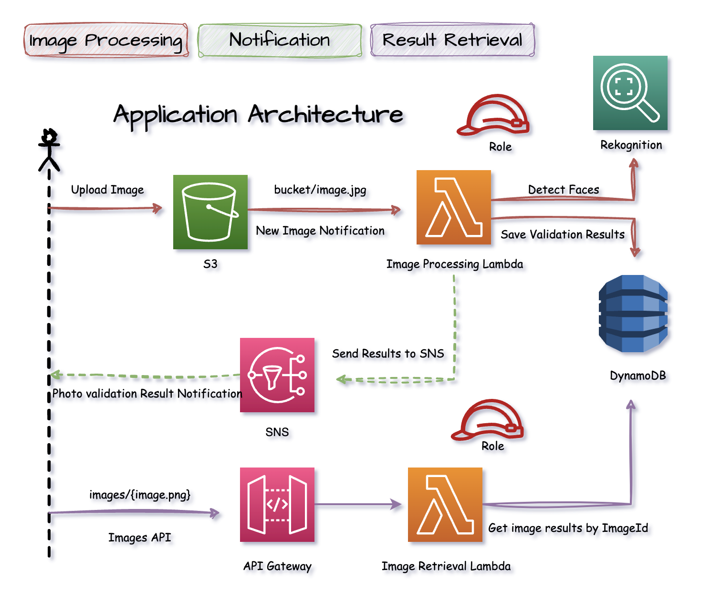

# Headshot Image Validation

## Description
Developed photo validation service that automates photo validation tasks based on certain facial criteria. 
Headshots where the person is not smiling, has mouth closed, eyes open, and is not wearing sunglasses are considered valid and pass verification.

## Application Features
- Image upload capability of images that require validation.
- Notification of image validation results.
- Storage of image validation results.
- Retrieval of image validation results.

## Technologies
- Java
- AWS Lambda Functions
- AWS Rekognition
- AWS DynamoDB
- AWS API Gateway
- AWS SNS Notification Service
- AWS CDK (Cloud Development Kit)

## Application Architecture
- Photos that require validation are uploaded to AWS S3 Bucket. 
- AWS Lambda function is triggered on photo upload and begins photo processing task.
- AWS Rekognition is handed image for facial validation tasks.
- Photo validation results are notified to client and saved to AWS DynamoDB.
- AWS API Gateway exposes endpoint for retrieving specific image validation results.
- AWS Lambda function is invoked by API Gateway that goes and fetches results from DynamoDB and returns them.

